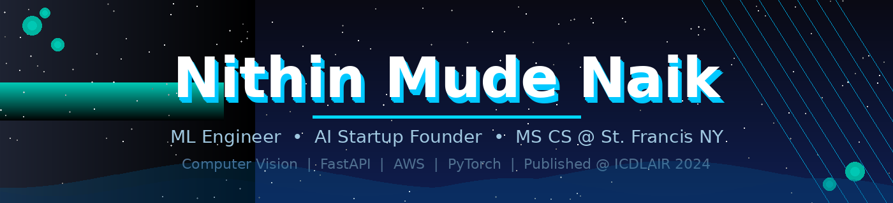

<div align="center">



</div>
---

```python
> whoami
name        : Nithin Mude Naik
role        : ML Engineer & AI Startup Founder 🐾
education   : MS Computer Science @ St. Francis College, New York (2026)
experience  : Data Analyst Intern @ ISB  |  ML Intern @ YHILLS (IIT Hyderabad)
focus       : Computer Vision · Deep Learning · FastAPI · Cloud ML Systems
research    : Published Researcher @ ICDLAIR 2024
location    : New Jersey, USA
contact     : nmude@sfc.edu
```

---

\> tech_stack

<div align="center">

[](https://skillicons.dev)

[](https://skillicons.dev)

[](https://skillicons.dev)

</div>

---

\> featured_projects

| Project | Description | Stack |
|---|---|---|
| [🐾 AI Pet Grooming System](https://github.com/mudenithinnaik/ai-pet-grooming-system) | World's first AI-automated grooming booth — CNN detects dog size & coat, auto-configures wash temp, pressure & drying | `Python` `CNN` `FastAPI` `AWS` `Raspberry Pi` |
| 🌿 Potato Disease Classifier | Multi-class CNN achieving **98.9% accuracy** — Early Blight, Late Blight & Healthy | `Python` `TensorFlow` `CNNs` `OpenCV` |
| 🐶 Smart Pet Health Monitor | Computer vision detecting pet skin conditions with real-time alerts & risk scores | `Python` `Computer Vision` `Cloud APIs` |

---

\> experience

**🏦 Data Analyst Intern — Indian School of Business (ISB)** *(Jul–Sep 2023)*
- Improved reporting accuracy **30%**, reduced reporting time **40%**
- Built dashboards with Tableau & Python, increased forecast accuracy **25%**

**🤖 ML Intern — YHILLS (IIT Hyderabad)** *(Jul–Nov 2022)*
- Achieved **92% model accuracy** on real-world datasets
- Reduced prediction error **20%** via feature engineering & hyperparameter tuning

---

\> certifications

| | Credential |
|---|---|
| 📄 | **Publication:** Enhancing Tea Leaf Disease Classification — ICDLAIR 2024 |
| 🤗 | Hugging Face — NLP & Transformers |
| ⚡ | FastAPI for Production ML Systems |
| ☁️ | AWS Skill Builder — Machine Learning Foundations |

---

\> contribution_graph

<div align="center">


</div>

---

\> connect

<div align="center">

[](https://www.linkedin.com/in/mudenithin)&nbsp;&nbsp;
[](https://github.com/mudenithinnaik)

📧 [nmude@sfc.edu](mailto:nmude@sfc.edu)


</div>

---

<div align="center">

*"The best time to build your dream is now."* 🐾

⭐ **Star my repos if you believe in the vision!**

</div>
